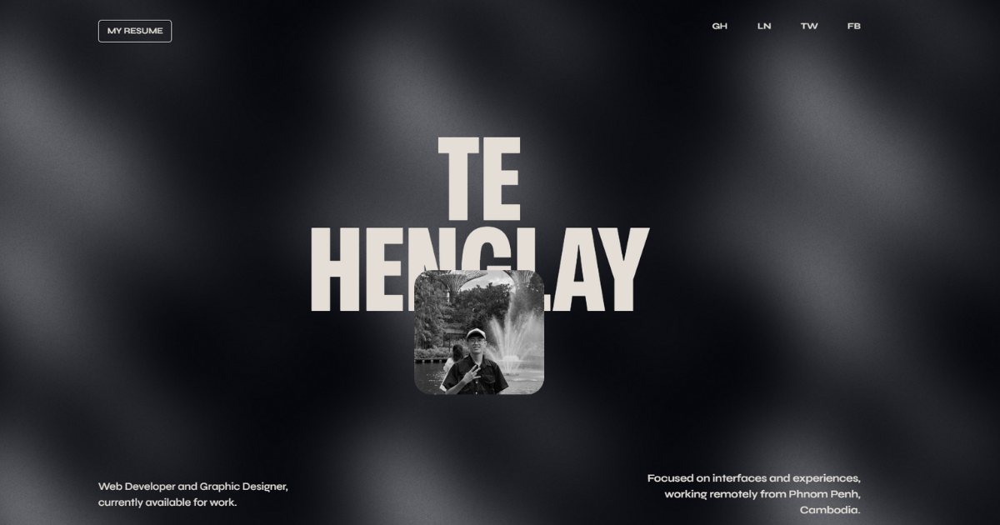

# 🚀 Te Henglay's Portfolio Website

A modern, responsive portfolio website built with Next.js 13, showcasing my work as a Web Developer and Graphic Designer from Phnom Penh, Cambodia.

## 🌟 Overview

This portfolio website serves as a comprehensive showcase of my skills, projects, and experience in web development and design. Built with cutting-edge technologies, it features smooth animations, interactive elements, and a clean, modern design aesthetic.

## ✨ Features

- **Modern Design**: Clean and minimalist UI with smooth animations
- **Responsive Layout**: Fully responsive design that works on all devices
- **Interactive Elements**: Custom cursor effects using Blobity
- **Smooth Animations**: Framer Motion and GSAP for fluid transitions
- **Dynamic Sections**: 
  - Hero section with animated profile
  - Work portfolio with project showcases
  - Client reviews and testimonials
  - About section with skills breakdown
  - Blog section for articles and insights
  - Contact form for inquiries
- **Performance Optimized**: Built with Next.js 13 App Router for optimal performance
- **SEO Friendly**: Proper meta tags and semantic HTML structure

## 🛠️ Tech Stack

### Frontend Framework
- **Next.js 13** - React framework with App Router
- **React 18** - UI library
- **TypeScript** - Type-safe JavaScript

### Styling & UI
- **Tailwind CSS** - Utility-first CSS framework
- **Framer Motion** - Animation library
- **GSAP** - High-performance animation library
- **FontAwesome** - Icon library
- **Custom Fonts** - Mona Sans font family

### Additional Libraries
- **Blobity** - Custom cursor effects
- **React Intersection Observer** - Scroll-based animations
- **Scroller Motion** - Scroll-driven animations
- **Sharp** - Image optimization

### Development Tools
- **ESLint** - Code linting
- **Prettier** - Code formatting
- **Autoprefixer** - CSS vendor prefixes
- **PostCSS** - CSS processing

## 🎨 Featured Projects

### Development Projects
1. **Cambodia Blockchain Summit** - Official website for Blockchain Summit Cambodia
2. **TWELVE AM** - Modern full-stack e-commerce platform
3. **Cipher Explorer** - Interactive encryption/decryption demo
4. **Twelve Music** - Music visualization application

## 📧 Contact & Social Links

- **Email**: [Your Email]
- **LinkedIn**: [Te Henglay](https://www.linkedin.com/in/te-henglay-74067532a/s)
- **GitHub**: [TeHenglay](https://github.com/TeHenglay)
- **Twitter**: [@Lay_Laszlo](https://x.com/Lay_Laszlo)
- **Facebook**: [HenglayTe](https://www.facebook.com/HenglayTe)

## 🎯 Skills & Technologies

### Web Development
- JavaScript (ES6+), TypeScript
- React, Next.js, Redux
- HTML5, CSS3, SCSS/SASS
- Node.js, PostgreSQL, Prisma
- Git/GitHub, NextAuth, Formik

### UI/UX Design
- Figma, Adobe XD, Framer
- Material UI, Tailwind CSS
- Framer Motion, GSAP
- UX Research, Prototyping
- Adobe Photoshop

## 🌍 About Me

I'm Te Henglay (aka Lay), a passionate web developer and student at the Royal University of Phnom Penh (RUPP). I specialize in creating visually appealing and user-friendly web applications, combining technical expertise with a keen eye for design.

Currently working on exciting projects through Laszlo Labs, including Discord music bots using Lavalink. Always open to new opportunities and collaborations.

## 🙏 Acknowledgments

- Built with inspiration from modern web design trends
- Special thanks to the open-source community
- Fonts provided by GitHub's Mona Sans

---

**⭐ If you like this project, please give it a star on GitHub!**

*Portfolio website showcasing the work of Te Henglay - Web Developer & Graphic Designer from Phnom Penh, Cambodia.*
